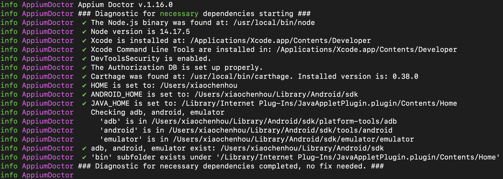
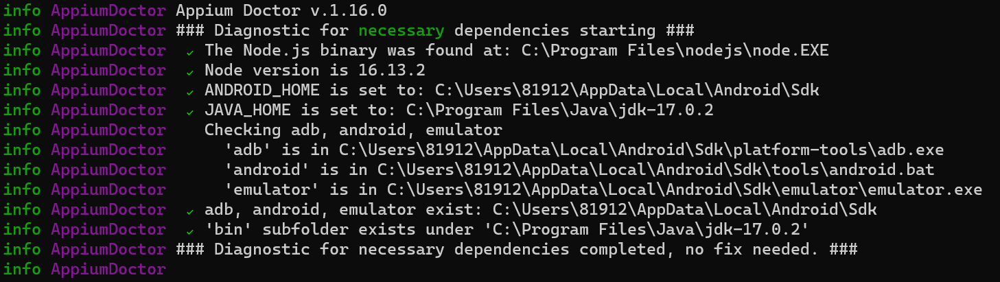
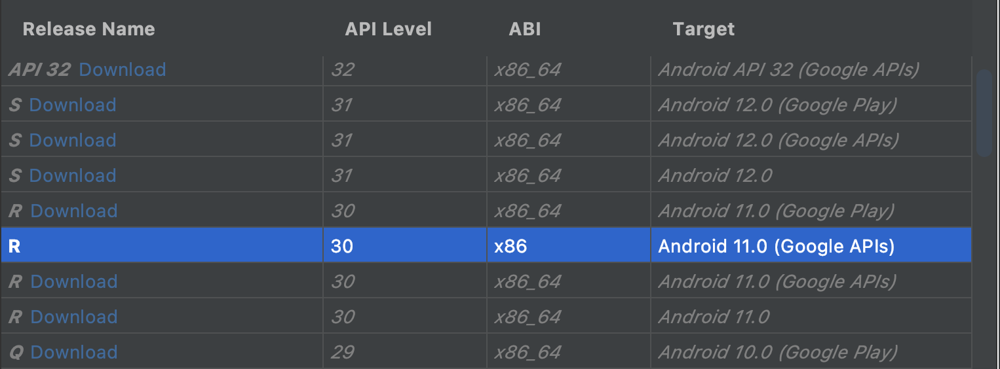

<h1 align="center">讯飞智影安卓自动化测试</h1>


<!-- PROJECT LOGO -->
<br />
<div align="center">
  <a href="https://www.iflyzhiying.com/">
    
  </a>

<h3 align="center">科大讯飞 ｜ 讯飞智影</h3>

  <p align="center">
    自动化进行基础冒烟测试
    <br/>
  </p>
</div>
<div id="top"></div>

## 关于项目

此项目开发并且用于科大讯飞公司，江西讯飞智影公司投影仪所配置的安卓手机app的冒烟的基础功能的测试。

请参照**环境搭建**来开始配置并应用此程序。

### 工具/框架

主要使用的工具以及框架

* [Appium（框架）](https://appium.io/)
* [Appium Inspector（UI元素查看工具）](https://github.com/appium/appium-inspector)
* uiautomatorviewer（Android sdk内置元素查看工具）
* [Pycharm（IDE）](https://www.jetbrains.com/pycharm/)
* [Android Emulator（安卓模拟器）](https://developer.android.com/studio/run/emulator)
* [Node.js](https://nodejs.org/en/)
* [npm](https://www.npmjs.com/)
* [Homebrew](https://brew.sh/)

## 环境搭建(从零开始)

请根据下面内容首先进行环境的搭建，根据自身情况进行调整，已经安装可以跳过。\
建议安装命令行版本而非GUI版本appium，这样可以只通过一个终端管理程序。

**_注意jdk请选择1.8版本进行安装，这样才能正常使用uiautomatorviewer_**

### Mac OS

1. 安装homebrew，打开终端并运行

   ```sh
   /bin/bash -c "$(curl -fsSL https://raw.githubusercontent.com/Homebrew/install/HEAD/install.sh)"
   ```

2. 安装Node.js，npm

   ```sh
   brew install node
   ```

3. 安装命令行appium

   ```sh
   npm install -g appium
   ```

4. 安装appium-doctor

   ```sh
   npm install appium-doctor -g
   ```

5. 安装Carthage

   ```sh
   brew install carthage
   ```

5. 配置`jdk1.8`（已经配置请忽略）

   <a href="https://blog.csdn.net/aishufan4507/article/details/102372067">按照这个链接的教程去配置jdk</a>

6. 配置安卓`sdk`（已经配置请忽略）

   <a href="https://blog.csdn.net/yanzisu_congcong/article/details/78365799">
   按照这个链接的教程去配置sdk</a>

7. 运行appium-doctor，并使所有**必须**环境得到绿色对勾✅（如下图所示）
   

### Windows

1. 安装Node.js, npm

   点击<a href="https://nodejs.org/en/download/">这里</a>选择windows下载并安装

2. 打开cmd安装appium

   ```sh
   npm install -g appium
   ```

3. 安装appium-doctor用来检查环境

    ```sh
    npm install -g appium-doctor
    ```
4. 下载并且安装`jdk1.8`，选择x64版本安装

   <a href="https://www.oracle.com/java/technologies/downloads/#java8-windows">点击这里下载从官网下载</a>

5. 配置JAVA_HOME`jdk1.8`（已经配置请忽略）

    <a href="https://blog.csdn.net/qq_42017152/article/details/90732057">
    按照这个链接的教程去配置JAVA_HOME</a>
6. 下载Android Studio

   <a href="https://developer.android.google.cn/studio/">
    点这里从官网下载Android Studio</a>

7. 配置ANDROID_HOME`sdk`（已经配置请忽略）

    <a href="https://www.jianshu.com/p/ff5a15217f4e">
    按照这个链接的教程去配置sdk</a>

8. 运行appium-doctor，并使所有**必须**环境得到绿色对勾✅（如下图所示）
   

## Android Emulator

打开android studio创建一个新的项目(project)，等待下载和加载完毕（服务器在谷歌可能会非常慢），右上角AVD Manager即是安卓模拟器。\
_特别说明：如果使用安卓的模拟器进行运行，请选择x86，Android 11.0镜像进行安装_


1. 查询设备名称列表
    ```sh
    emulator -list-avds
    ```
2. 启动制定模拟器
    ```sh
    emulator @设备名称
    ```

<p align="right">(<a href="#top">回到顶部</a>)</p>


<!-- USAGE EXAMPLES -->

## 使用方法

1. 将整个仓库(repository)克隆到本地（需要安装git，没安装的百度即可）
    1. 先进入到自己想放置的位置目录（桌面为例）
       ```sh
        cd desktop
        ```
    2. 克隆(clone)到本地
        ```sh
        git clone https://github.com/XiaochenHou/zhiying_android_automation.git
        ```
2. 找到`constant.py`文件，修改里面的常量，下面是*样例*

   ```python
   PHONE_NUMBER = "13661045480"    # 自己手机号
   EXTRACT_CODE = "test_for_test"  # 提取会议记录码
   DEVICE_NAME = "emulator-5554"   # 设备名称(adb devices)
   P_VERSION = "11.0.0"            # 安卓版本
   SEARCH_CONTENT = "会议"          # 自定义搜索内容
   ```
   如果不是全部流程的话，确保账户已经提前登陆。
3. 安装Appium-Python-Client库

   ```sh
   pip install Appium-Python-Client
   ```

4. 将手机连接到电脑，或者启动模拟器，当`adb devices`可以识别到设备代表连接成功

5. 打开终端或cmd，输入appium启动serve，**记得不要关闭这个页面**

6. 在terminal或cmd运行程序的main方法
   ```sh
   python3 main.py
   ```
7. 通过命令行-h来查看所有命令
    ```sh
   python3 main.py -h
   ```
8. 可以通过命令行flag来控制想要单独测试的部分模块，例如，只测试主页，如下：
   ```sh
   python3 main.py --main
   ```

<p align="right">(<a href="#top">回到顶部</a>)</p>

## 许可证

根据 MIT 许可证分发。 有关更多信息，请参阅`LICENSE.txt`。

<p align="right">(<a href="#top">回到顶部</a>)</p>


<!-- CONTACT -->

## 联系方式

侯啸辰 - xchou2@iflytek.com - 13661045480(微信同号)

项目链接: [GitHub](https://github.com/XiaochenHou/zhiying_android_automation) |
[Gitee](https://gitee.com/xiaochenhou/zhiying_android_automation)

<p align="right">(<a href="#top">回到顶部</a>)</p>

<!-- ACKNOWLEDGMENTS -->

## 致谢

以下这些资源帮助我完成了这个项目，诚挚的表示感谢，希望此项目可以帮助到更多人

* [How to install appium on Windows](https://www.youtube.com/watch?v=x-hBpgM5je8&t=2s)
* [How to install appium on MacOS](https://www.youtube.com/watch?v=7APcLr-cBM8)
* [Automation Step by Step](https://www.youtube.com/channel/UCTt7pyY-o0eltq14glaG5dg)
* [Python+Appium实现APP自动化测试](https://baijiahao.baidu.com/s?id=1662021502495073716&wfr=spider&for=pc)
* [Best-README-Template](https://github.com/othneildrew/Best-README-Template)

环境部署和代码遇到了很多的问题以及报错，感谢下面几个社区帮助我解决问题：

* [Appium Discuss](https://discuss.appium.io/)
* [Stack Overflow](https://stackoverflow.com/)
* [CSDN](https://www.csdn.net/)

<p align="right">(<a href="#top">回到顶部</a>)</p>
